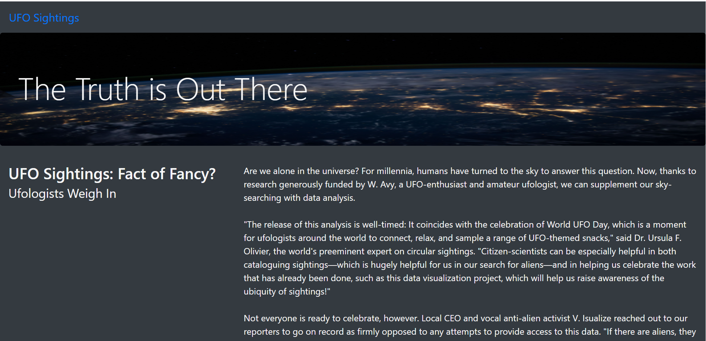
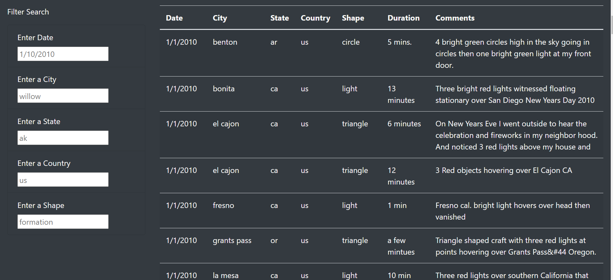
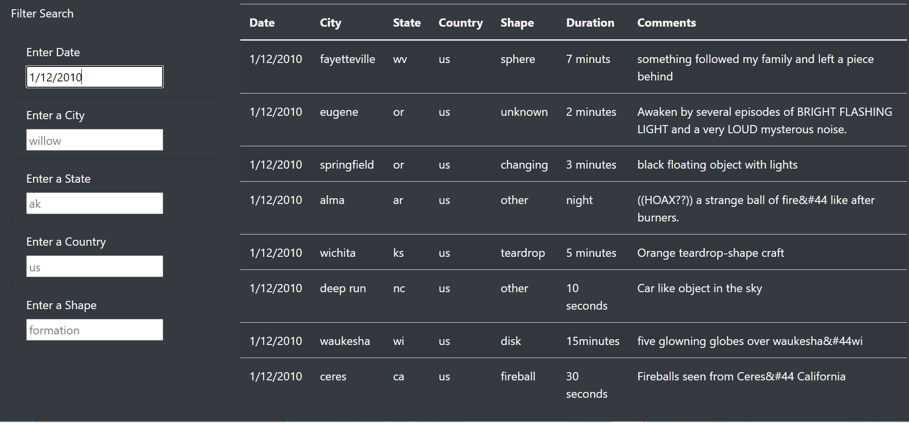
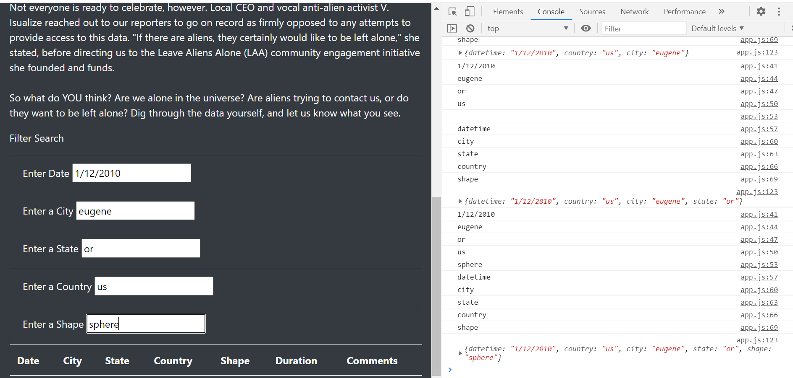
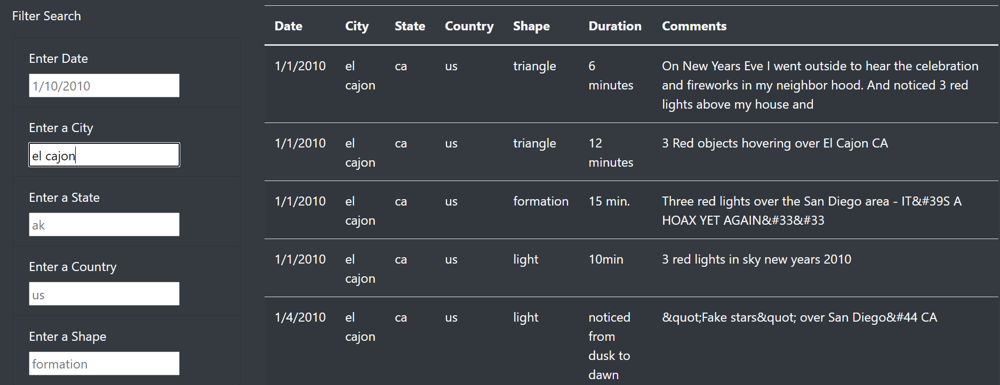
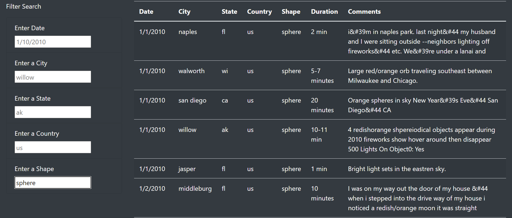
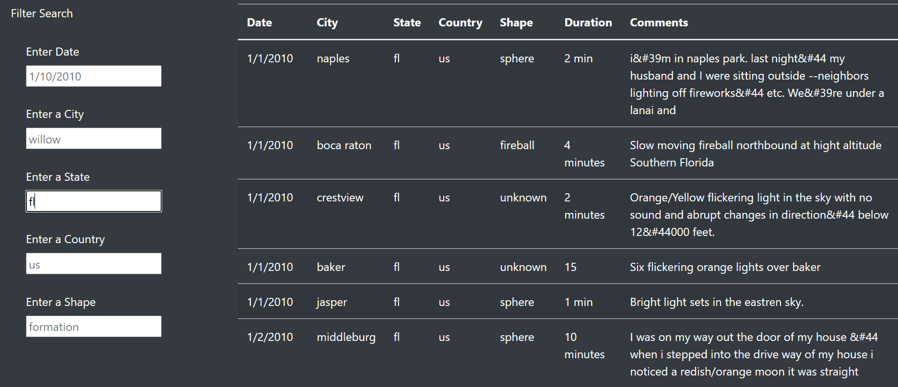
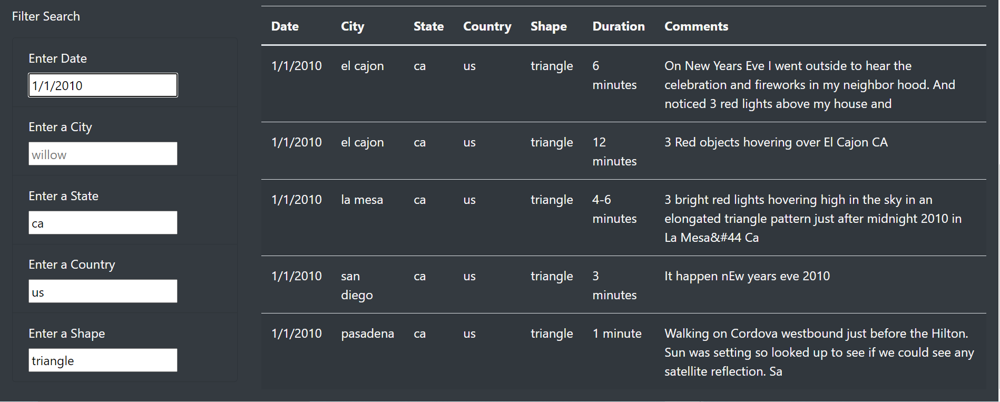

# UFOs

# Overview of the analysis

We are supporting Dana into building a more in-depth analysis of UFO sightings by allowing users to filter for multiple criteria at the same time. We have added, in addition to the date, a table filters for the city, state, country, and shape.

With this new functionality, the users will be able to have options for specific search an retrieve data with more conveniences.
As a recap, a preview of the webpage layout is presented below with the title of the project and an overview.

- Webpage Layout

The layout and the Mars planet are displayed on the backgoud to emphasize the UFOs topic.

# Results

The new functionalities are working correctly.
In the image below, the filter search include the new filters with date, city, state, country and shape.

- Filter Overview

To test our functionality, we have filteed by state (), city(), country(), date() and shape the new webpage. 
Below are the three specific search results.

- By Date

Date are well displayed and selected on the console. See console below for the same and replicated for the other search.

- Console log image

- By City

User typing a city, el cajon, and displayed correctly with related data.
- By shape

- By State

- By Country

  

# Summary
- The main drawbakc is the conveniece of using the webpage. The users would be better off by selecting sepcific search terms instead of inputting the search on the webpage.
- With that being stated, our webpage will need the following adjustement to be convenient:
    - A drop down button with all data
    - Adding all filters to the table for results to display when selecting the drop down. With this, a farther deployment to a host for visibility to users will be an interresting evolution for our work.

